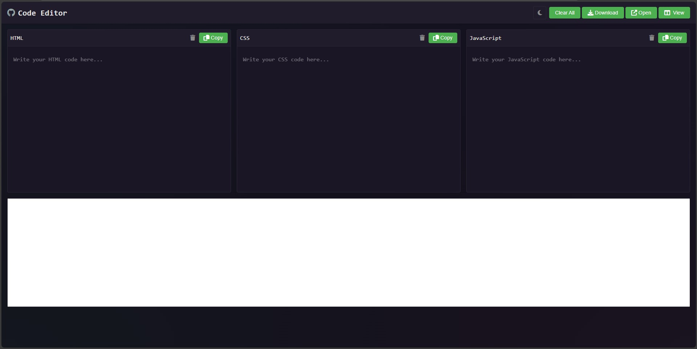

# Live Code Editor & Preview 

A powerful, browser-based code editor for HTML, CSS, and JavaScript with real-time preview functionality. Write, test, and visualize your web code instantly!

## 🚀 Features

- **Real-time Preview**: See your changes instantly as you type
- **Syntax Highlighting**: Powered by Prism.js for clear, beautiful code visualization
- **Multiple View Modes**: 
  - Bottom Preview (Default)
  - Left Preview
  - Right Preview
- **Theme Support**: 
  - Light Mode / Dark Mode
- **Auto-Save**: Never lose your work with automatic localStorage saving
- **Export Options**:
  - Download as ZIP (only includes files with content)
  - Copy individual editor content
  - Open preview in new tab
- **Smart Indentation**: Proper tab key handling
- **Responsive Design**: Works on desktop and mobile devices

## 📸 Screenshots

<strong> Live URL: https://sayfullahsayeb.github.io/Live-Code-Editor/ </strong>

## 🛠️ Built With

- HTML5
- CSS3
- Vanilla JavaScript
- [Prism.js](https://prismjs.com/) - For syntax highlighting
- [Font Awesome](https://fontawesome.com/) - For icons
- [JSZip](https://stuk.github.io/jszip/) - For code download functionality

## 🔧 Installation

Clone the repository to your local machine: bash 

<pre> <code> git clone https://github.com/SayfullahSayeb/Live-Code-Editor </code> </pre> 

Open `index.html` in your browser That's it! No build process or server required.

## 🔐 Local Storage

The editor automatically saves your:
- Code content
- Theme preference
- View mode preference

Your code persists between sessions until you clear your browser data.

## 🌐 Browser Support

Works in all modern browsers supporting ES6+ and localStorage: 

- <strong> Chrome, Firefox, Safari, Edge </strong>

## 📝 License

This project is open source and available under the MIT License. - see the [LICENSE](LICENSE) file for details.

## 🤝 Contributing

Contributions, issues, and feature requests are welcome! Feel free to check issues page.

## 👥 Authors

- **[Sayfullah Sayeb](https://github.com/SayfullahSayeb)** - *Initial work*

## 🙏 Acknowledgments

- Prism.js team for the syntax highlighting library
- Font Awesome for the icons
- JSZip for the download functionality
